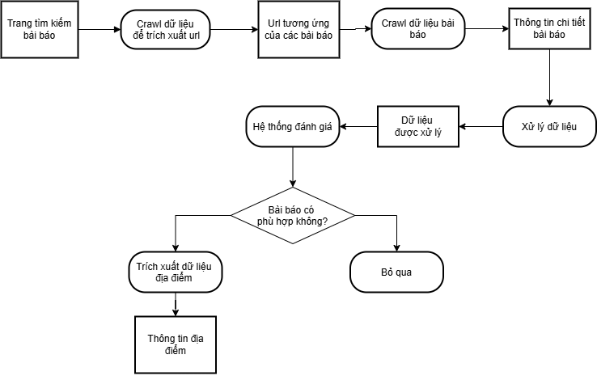

# Mô hình AI truy xuất thông tin từ bài báo

## 1. Ý tưởng hình thành mô hình
Đối với các ứng dụng cần đưa tin tức nhanh chóng và hiệu quả dành cho người dùng, việc truy xuất thông tin từ các bài báo là một phương pháp vô cùng hữu hiệu. Tuy nhiên, các bài báo có thể mang nhiều thông tin khác nhau, sẽ có một số bài báo phù hợp với yêu cầu của chúng ta còn một số thì không. Từ đó, ý tưởng phát triển một mô hình AI để đọc bài báo và kiểm tra thông tin được ra đời.

---

## 2. Mô tả mô hình
Plugin này có chức năng:
- **Crawl dữ liệu** từ trang tìm kiếm của VNExpress.
- **Lọc các URL** của những bài báo liên quan đến các trường hợp nguy hiểm (thiên tai, bệnh dịch).
- **Trích xuất các địa điểm** được đề cập trong những bài báo này.

---

## 3. Cách hoạt động của mô hình
Cách hoạt động của mô hình có thể được miêu tả thông qua hình ảnh sau:

### Giải thích chi tiết các xử lý:
1. **Crawl dữ liệu để trích xuất URL**:  
   Tiến hành crawl dữ liệu từ trang tìm kiếm để có được URL mà trang này tìm kiếm được, thông qua hỗ trợ của thư viện `BeautifulSoup`.

2. **Crawl dữ liệu bài báo**:  
   Tiến hành crawl dữ liệu bài báo để có thông tin về tiêu đề, tóm tắt và chi tiết bài báo.

3. **Xử lý dữ liệu**:  
   Từ nội dung bài báo, chuyển nó thành các vector để đưa vào mô hình đánh giá.

4. **Hệ thống đánh giá**:  
   Sử dụng hệ thống perceptron (mạng nơ-ron nhân tạo) để đánh giá xem bài báo có phù hợp với yêu cầu hay không.

5. **Trích xuất dữ liệu từ địa điểm**:  
   Tìm kiếm trong nội dung bài báo những địa điểm, thành phố được đề cập.

---

## 4. Cấu trúc dự án

### **Thư mục**
- `datasets`: Lưu datasets dùng để huấn luyện mô hình.
- `inputs`: Những dữ liệu đầu vào sử dụng để tạo datasets và huấn luyện mô hình.
- `models`: Nơi lưu dữ liệu mô hình tốt nhất được huấn luyện.
- `sample`: Những dữ liệu mẫu (những keywords) được sử dụng để mô hình xác định và hình thành các vector.
- `utils`: Chứa các hàm để crawl và xử lý dữ liệu.

### **Các hàm xử lý**
- `create_datasets.py`: Thêm vào datasets từ tập input đã cho.
- `perceptron.py`: Lưu kiến trúc mạng nơ-ron dành cho mô hình.
- `shuffle_datasets.py`: Trộn datasets để tiến hành việc học.
- `train_model.py`: Huấn luyện mô hình từ datasets đã cho.
- `use_models.py`: Sử dụng mô hình đã huấn luyện.

---

**Ghi chú:**  
Dự án này sử dụng các công cụ Python như `BeautifulSoup` và các thư viện học máy để thực hiện các bước xử lý dữ liệu và xây dựng mô hình.
