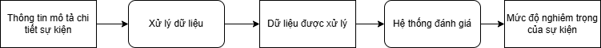

# Mô hình AI đánh giá mức độ nghiêm trọng của sự kiện

## 1. Ý tưởng hình thành mô hình
Trong một số dự án làm về tình nguyện cũng như thiên tai, việc đánh giá mức độ nghiêm trọng của một sự kiện là một điều vô cùng cần thiết. Tuy nhiên, nếu số lượng sự kiện quá lớn, việc kiểm tra và đánh giá có thể mất thời gian. Từ đó, ý tưởng đánh giá mức độ nghiêm trọng của một sự kiện thông qua miêu tả được ra đời, giúp giảm bớt áp lực về công việc dành cho người đánh giá.

---

## 2. Mô tả mô hình
Plugin này sử dụng các thông tin mô tả cụ thể về thiệt hại, như:
- **Số người thiệt mạng.**
- **Số người bị thương.**
- **Thiệt hại về tài sản.**

Từ đó, plugin phân tích và đưa ra dự đoán về mức độ nghiêm trọng của sự kiện với các cấp độ:
- **Mức độ 0**: Không gây nhiều thiệt hại, mức độ khẩn cấp thấp.
- **Mức độ 1**: Thiệt hại nhẹ về người và tài sản, mức độ khẩn cấp trung bình.
- **Mức độ 2**: Thiệt hại khá cao, mức độ khẩn cấp cao, cần hỗ trợ kịp thời.
- **Mức độ 3**: Thiệt hại lớn, đời sống bị ảnh hưởng nghiêm trọng, mức độ khẩn cấp rất cao.

Hệ thống hoạt động dựa trên **xử lý ngôn ngữ tự nhiên (NLP)**, do đó việc miêu tả được ghi chi tiết và cụ thể (có bao nhiêu người chết, bị thương, thiệt hại tài sản, v.v.) sẽ ảnh hưởng rất nhiều đến hiệu quả hoạt động của mô hình. Đánh giá càng chi tiết và rõ ràng thì hệ thống hoạt động càng tốt và ngược lại.

---

## 3. Cách hoạt động của mô hình
Cách hoạt động của mô hình có thể được mô tả như sau:

### Chi tiết các xử lý:
1. **Xử lý dữ liệu**:  
   Đọc và xuất ra các dữ liệu cần thiết cho việc đánh giá, như số người chết, số người bị thương, thiệt hại về tài sản, cũng như phần trăm các keywords về thiên tai có trong miêu tả. Những dữ liệu này sẽ được đưa vào một vector phục vụ cho việc đánh giá.

2. **Hệ thống đánh giá**:  
   Sử dụng giải thuật **Decision Tree (Cây quyết định)** để tiến hành đánh giá từ dữ liệu đầu vào.

---

## 4. Cấu trúc dự án

### **Thư mục**
- `datasets`: Lưu datasets dùng để huấn luyện mô hình.
- `inputs`: Những dữ liệu đầu vào sử dụng để tạo datasets và huấn luyện mô hình.
- `models`: Nơi lưu dữ liệu mô hình tốt nhất được huấn luyện.
- `sample`: Những dữ liệu mẫu (những keywords) được sử dụng để mô hình xác định và hình thành các vector.

### **Các hàm xử lý**
- `analyze_data.py`: Xử lý dữ liệu đầu vào.
- `create_datasets.py`: Thêm vào datasets từ tập input đã cho.
- `create_model.py`: Huấn luyện mô hình từ datasets đã cho.
- `shuffle_datasets.py`: Trộn datasets để tiến hành việc học.
- `use_models.py`: Sử dụng mô hình đã huấn luyện.

---

**Ghi chú:**  
Dự án này sử dụng các công cụ Python và các thư viện liên quan đến NLP và Decision Tree để thực hiện các bước xử lý dữ liệu và xây dựng mô hình.
